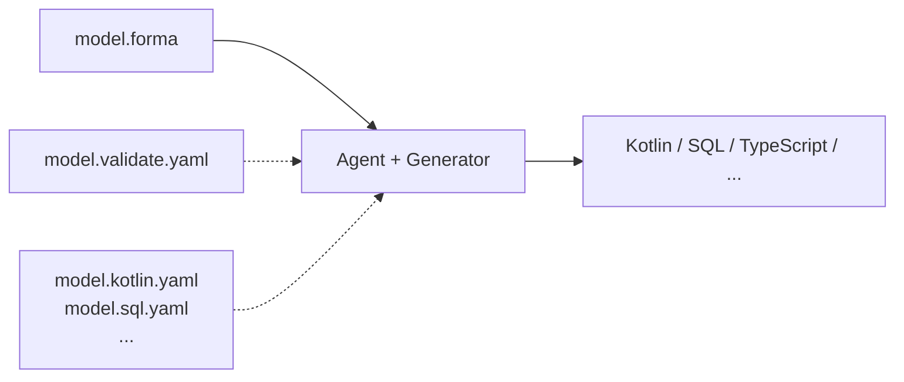

# Forma

A data model definition format. Describe the shape of your data once, generate code for any target.

## What is Forma?

Forma is a language-agnostic data model definition format designed for agent-assisted code generation. You write a single `model.forma` describing your shapes. Target profiles tell the generator how to express that structure in Kotlin, TypeScript, SQL, or anything else.

```forma
(shape Location
  latitude: float
  longitude: float)

(shape User [Timestamped]
  id: UserId
  name: string
  email: Email
  status: Status
  location: Location?)

(choice Status active archived deleted)
```

## Design Philosophy

**Structure, not validation.** The core spec describes what data *is* — types, fields, references. How it's validated, serialized, or stored is handled by satellite documents.

**Minimal boilerplate.** Non-null by default (`?` opts in to nullable). Every field is just `name: type`. S-expression syntax keeps declarations clean and uniform.

**Hub and satellites.** One structural model, many target-specific profiles:

```
model.forma             ← What the data is (hub)
model.validate.yaml     ← How it's validated (satellite)
model.kotlin.yaml       ← How it maps to Kotlin (satellite)
model.sql.yaml          ← How it maps to SQL (satellite)
```



## Type System

Three concepts for describing data shape:

| Concept | Purpose | Example |
|---|---|---|
| **Shapes** | Named structured types | `(shape Location latitude: float longitude: float)` |
| **Choices** | Variants or fixed value sets | `(choice Status active archived deleted)` |
| **Mixins** | Shared field templates (with composition) | `(mixin Auditable [Timestamped] created_by: UserId)` |

Unresolved names (like `UserId`, `Email`) are **atoms** — target profiles map them to concrete types.

## Quick Start

### 1. Define your model

Create a `model.forma`:

```forma
(model MyApp v1.0 "My application data model")

(mixin Timestamped
  created_at: datetime
  updated_at: datetime?)

(shape User [Timestamped]
  id: UserId
  name: string
  email: string)
```

### 2. Add a target profile (optional)

Create a `model.kotlin.yaml`:

```yaml
target: kotlin

type_mappings:
  string: String
  UUID: java.util.UUID
  datetime: kotlinx.datetime.Instant

emitters:
  model:
    package: com.example.myapp.model
    immutability: full
    serialization: kotlinx-serialization
    shape: data_class
    choice: enum_class
```

### 3. Generate

Give both files to an agent with the Forma skill. It reads the model + profile and produces idiomatic code for your target.

## Repo Structure

```
forma/
├── spec/
│   └── SPEC.md                         # Core format specification
├── commands/
│   └── forma.md                        # Distributable custom command for Claude Code
├── tools/
│   ├── validate.py                     # Hub model validator
│   └── forma_parser.py                # .forma DSL parser
├── references/
│   ├── satellite-architecture.md       # Hub-and-satellite pattern
│   ├── kotlin-profile.md              # Kotlin target profile docs
│   └── sql-profile.md                 # SQL target profile docs
├── examples/
│   ├── birdtracker.forma               # Complete example model
│   ├── birdtracker.kotlin.yaml         # Example Kotlin target profile
│   ├── birdtracker.sql.yaml            # Example SQL target profile
│   └── birdtracker.validate.yaml       # Example validation satellite
├── CHANGELOG.md                        # Version history
└── CONTRIBUTING.md                     # How to contribute target profiles
```

### Key Files

- **[`spec/SPEC.md`](spec/SPEC.md)** — The full format specification. Read this to understand every feature.
- **[`commands/forma.md`](commands/forma.md)** — Custom command for Claude Code. Symlink into your project's `.claude/commands/`.
- **[`examples/birdtracker.forma`](examples/birdtracker.forma)** — Annotated example using all features.

## Features

- **S-expression syntax**: Clean `(keyword name ...body...)` forms — minimal token types
- **Nullability**: `name: string` (required) vs `bio: text?` (nullable)
- **Shapes**: All structured types via `(shape ...)` — role determined by structural signals
- **Choices**: Unified enums + unions via `(choice ...)` — all-bare = enum-like, fielded = union-like
- **Mixins**: `[Timestamped]` — shared fields with composition support
- **Structural primitives**: `[T]` (collection), `{K, V}` (association) — shorthand for `coll<T>`, `dict<K, V>`
- **Angle-bracket generics**: `tree<T>`, `Versioned<Bird>` — unified type parameterization + named wrappers via target profiles
- **References as fields**: `bird: Bird`, `observations: [Observation]` — targets infer cardinality
- **Satellite architecture**: Validation, target profiles, and layer overrides in separate files

## Using the Custom Command

```bash
# Clone the forma repo
git clone https://github.com/phansen314/forma ~/tools/forma

# (Optional) Pin to a version
cd ~/tools/forma && git checkout v8.0

# Symlink the command — personal (all projects) or project-level
# Personal:
ln -s ~/tools/forma/commands/forma.md ~/.claude/commands/forma.md
# Project:
ln -s ~/tools/forma/commands/forma.md my-project/.claude/commands/forma.md

# Use it
# /forma mymodel.forma --kotlin
```

The command is self-contained — it includes syntax reference, task workflows, and diagnostic codes. For target-specific deep dives, it reads reference docs from the forma repo via symlink resolution.

## License

MIT
