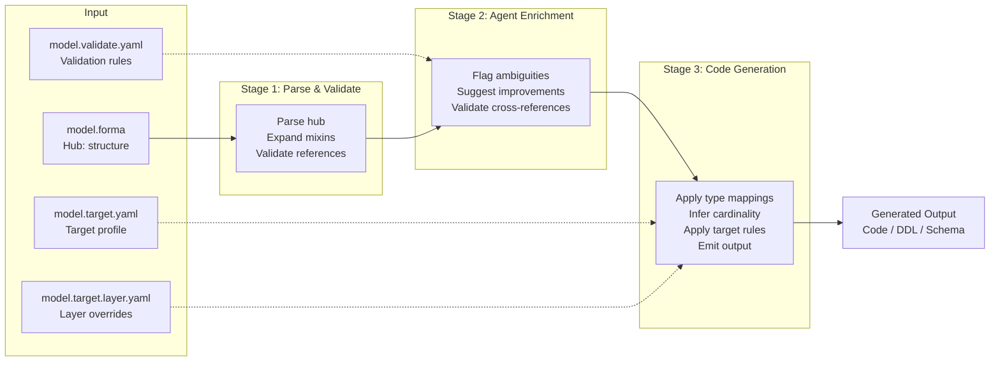

# Data Model Definition Format — v8

## Overview

A format for defining data models that agents can parse, refine, and convert into language-specific code and database schemas.

The hub format is **`.forma`** — a custom DSL using S-expression syntax. Every declaration is a parenthesized form: `(keyword name ...body...)`.

Satellite documents (validation, target profiles) are YAML.

## Design Principles

- **Structure, not validation**: This spec describes the *shape* of data — shapes, fields, and references. Behavioral rules (format validation, range checks, immutability) belong in a validation satellite document.
- **Pure shape in the hub**: The hub describes *what data is*. Constraints (`primary_key`, `unique`, `default`), relationship cardinality declarations, and foreign key derivation are satellite concerns — they describe how data is *used* or *stored*.
- **Minimal boilerplate**: The common case should be short; verbosity only when expressing complex constraints
- **Agent-friendly**: Semi-structured enough for agents to parse and infer meaning, constrained enough to validate
- **Three-stage pipeline**: Parse/validate → agent enrichment → code generation
- **Language-agnostic**: Core spec describes shape only; target profiles handle language and persistence specifics

---

## Document Architecture

The data model is defined across multiple focused documents. The hub (`.forma`) is small, target-agnostic, and concerned only with shape. Satellite documents add context for specific concerns:

```
model.forma              ← Structure (hub): shapes, fields, references
model.validate.yaml      ← Validation: format rules, range checks, identity, constraints
model.kotlin.yaml        ← Kotlin target profile: collections, immutability
model.typescript.yaml    ← TypeScript target profile: Zod vs io-ts, ESM vs CJS
model.sql.yaml           ← SQL target profile: dialect, indexing strategy, PK/FK/unique
```

Each satellite document references shapes and fields from the hub by name. The agent loads whichever documents are relevant to the current task — generating Kotlin code pulls in the hub + `model.kotlin.yaml`; adding validation pulls in the hub + `model.validate.yaml`.

This keeps each file small and single-purpose. The hub never grows to accommodate satellite concerns.

---

## Type System

The spec provides three concepts for describing data shape:

| Concept | Purpose | Used as a field type? |
|---|---|---|
| **Shapes** | Named structured types with optional mixin fields | Yes |
| **Choices** | Discriminated alternatives — enum-like (all bare) or union-like (fielded variants) | Yes |
| **Mixins** | Shared field templates inlined into shapes, with optional composition | No — field shortcut only |

These sit on top of two structural primitives for grouping values: `[T]` (collection) and `{K, V}` (association), plus optional named wrappers like `tree<T>`.

### Atoms

Any name used as a field type that is not declared as a shape, choice, or mixin is an **atom**. Atoms are valid — the hub makes no claim about what they resolve to. Target profiles map atoms to concrete types.

Common atoms by convention: `string`, `int`, `float`, `bool`, `text`, `datetime`, `date`, `UUID`, `json`. Domain-specific atoms like `BirdId`, `UserId`, `Email` carry semantic meaning without requiring a hub-level declaration. Target profiles decide how each atom is represented — a transparent type alias, a branded type, a value class, etc.

The hub never warns about unresolved atoms. Atom resolution is a target concern.

---

## Syntax

The `.forma` format uses S-expression syntax — every declaration is a parenthesized form `(keyword name ...body...)`. This eliminates YAML scaffolding and reduces the token set to a minimum.

### Grammar (EBNF)

```ebnf
file           = { comment | form } EOF ;
form           = "(" ( namespace_form | model_form
                     | mixin_form | mixins_form
                     | choice_form | choices_form
                     | shape_form | shapes_form ) ")" ;

namespace_form = "namespace" IDENT ;

model_form     = "model" IDENT version [ STRING ] ;
version        = IDENT ;
mixin_form     = "mixin" IDENT [ "<" IDENT { "," IDENT } ">" ]
                 [ "[" mixin_ref { mixin_ref } "]" ] { field } ;
mixins_form    = "mixins" { "(" IDENT [ "<" IDENT { "," IDENT } ">" ]
                 [ "[" mixin_ref { mixin_ref } "]" ] { field } ")" } ;
choice_form    = "choice" IDENT { common_form | variant } ;
choices_form   = "choices" { "(" IDENT { common_form | variant } ")" } ;
shape_form     = "shape" IDENT [ "[" mixin_ref { mixin_ref } "]" ] { field } ;
shapes_form    = "shapes" { "(" IDENT [ "[" mixin_ref { mixin_ref } "]" ] { field } ")" } ;
common_form    = "(" "common" { field } ")" ;
variant        = IDENT | "(" IDENT { field } ")" ;

mixin_ref      = IDENT [ "<" type_expr { "," type_expr } ">" ] ;
field          = IDENT ":" type_expr ;
type_expr      = base_type [ "?" ] ;
base_type      = IDENT [ "<" type_expr { "," type_expr } ">" ]
               | "[" type_expr { "," type_expr } "]"
               | "{" type_expr "," type_expr "}" ;

comment        = "//" { any } EOL
               | "/*" { any | comment } "*/" ;
STRING         = '"' { any } '"' ;
IDENT          = letter { letter | digit | "_" | "." } ;
```

Parentheses delimit forms. Brackets serve two roles: anonymous collections (`[T]`) and mixin lists on shapes and mixins (`[Timestamped]`). Braces delimit anonymous associations (`{K, V}`). Angle brackets delimit type parameters (`tree<T>`, `Versioned<Bird>`). Commas appear inside collections, associations, and generic argument lists. Comment delimiters (`//`, `/*`, `*/`) are stripped during lexing and do not appear as tokens. The token count remains 12.

### Comments

```forma
// Line comments use double-slash

/* Block comments use slash-star ... star-slash */

/*
 * Multi-line block comments work naturally.
 * Useful for file headers and documentation.
 */

/* Block comments /* can be nested */ like this */
```

Block comments support nesting — each `/*` must be matched by a corresponding `*/`. This allows commenting out code that already contains block comments. Unterminated block comments are a parse error.

### Namespace Declaration

```forma
(namespace com.example.birdtracker)
```

An optional form declaring the model's logical namespace — a dotted identifier representing its package or module identity. At most one namespace declaration per file.

The namespace is stored in the IR under `meta.namespace`. Generators use it as the default package/module when the satellite doesn't override via `globals.package`. Within the hub, the namespace has no effect on name resolution — names stay flat.

Convention: the namespace declaration appears before `(model ...)`, but order is not enforced by the parser.

### Model Declaration

```forma
(model BirdTracker v8.0 "Bird observation tracking system")
```

One form declares the model name, version, and optional description.

### Mixins

```forma
(mixin Timestamped
  created_at: datetime
  updated_at: datetime?)
```

Shapes pull in mixin fields with a bracket list after the name:

```forma
(shape User [Timestamped]
  id: UserId
  username: string)
```

`User` now has `id`, `username`, `created_at`, and `updated_at`.

#### Generic Mixins

Mixins can declare type parameters in angle brackets. The type parameters are substituted with concrete types when the mixin is applied:

```forma
(mixin Versioned<T>
  current: T
  history: [T]
  version: int)

(shape Bird [Versioned<Bird> Timestamped]
  name: string
  species: Species)
```

`Bird` now has `current: Bird`, `history: [Bird]`, `version: int`, plus the `Timestamped` fields. Multiple type parameters are comma-separated: `<T, U>`.

#### Mixin Composition

Mixins can include other mixins using a bracket list, just like shapes:

```forma
(mixin Timestamped
  created_at: datetime
  updated_at: datetime?)

(mixin Auditable [Timestamped]
  created_by: UserId
  updated_by: UserId?)
```

`Auditable` now includes all of `Timestamped`'s fields (`created_at`, `updated_at`) plus its own (`created_by`, `updated_by`). A shape using `[Auditable]` gets all four fields.

Composition is transitive — if `A` includes `B` and `B` includes `C`, then `A` includes the fields of both `B` and `C`.

#### Rules

- **Multiple mixins allowed.** A shape can use any number of mixins.
- **Mixin composition.** Mixins can include other mixins using bracket lists. Composition is transitive.
- **Circular composition is an error.** If mixin A includes B and B includes A (directly or transitively), this is an error.
- **Mixin–mixin conflicts are errors.** If two mixins define the same field name (including via composition), this is an error. Rename one field or extract a shared mixin.
- **Shape fields shadow mixin fields.** If a shape declares a field that also exists in a mixin, the shape's own field wins. The validator emits a warning.
- **Mixins are not types.** You cannot use a mixin name as a field type. `location: Timestamped` is invalid — use a shape for typed field groups.
- **Generic arity is checked.** If a mixin declares type parameters, the mixin reference must supply the same number of type arguments. `[Versioned]` is an error if `Versioned` requires one type argument.
- **No type parameter constraints.** No bounds like `<T: Timestamped>`. Bounds are a behavioral concern — keep the hub simple.

#### Mixins vs shapes

These serve different purposes:

- **Shapes** define a *named structure* used as a field type. `location: Location` creates a `Location` value *inside* the parent shape.
- **Mixins** define *fields that merge into* the shape. `[Timestamped]` adds `created_at` and `updated_at` as top-level fields on the shape.

The test: "Is this a value I'd reference as a type?" → shape. "Are these fields I want on multiple shapes?" → mixin.

### Choices

Choices unify enums and unions into a single concept. A choice is a set of named alternatives. If all alternatives are bare identifiers (no fields), it behaves like an enum. If any alternative has fields, it behaves like a discriminated union.

#### Enum-like choices (all bare variants)

```forma
(choice ConservationStatus least_concern vulnerable endangered critical extinct)
(choice Habitat forest wetland grassland coastal urban)
```

Space-separated variant names inside the form. Target profiles decide how to represent these — standard enums, bitmasks, string constants, etc.

#### Union-like choices (fielded variants)

```forma
(choice MediaAttachment
  (common
    url: string
    caption: string?)
  (Photo
    width: int
    height: int)
  (Audio
    duration_seconds: float
    format: string))
```

The `(common ...)` sub-form defines fields shared by all variants. Variant sub-forms define variant-specific fields. Fieldless variants are bare identifiers — no sub-form needed:

```forma
(choice Result
  (Success
    data: string)
  NotFound
  Unauthorized)
```

`NotFound` and `Unauthorized` are empty variants (bare identifiers without a sub-form).

#### Rules

- **Choices are types.** They can be used anywhere a type is expected: shape fields, other choices, etc.
- **Variants are not standalone types.** They exist only as members of their choice.
- **Nullable choices work as expected.** `payment: PaymentMethod?` means the field can be null *or* one of the variants.
- **Fieldless variants are allowed.** A variant with no fields acts as a marker/tag.
- **Variant fields follow standard rules.** Fields inside variants (and common blocks) support the same syntax as shape fields, including nullability (`caption: string?`).
- **Target profiles decide representation.** A Kotlin profile maps fielded choices to `sealed class` + `data class` variants, and all-bare choices to `enum class`. SQL might use a discriminator column or native enum — that's a target profile decision.

### Plural Forms

Every singular keyword has a plural counterpart (`mixins`, `choices`, `shapes`) that groups multiple definitions into a single form. The plural form produces the same IR — it is purely a surface-syntax convenience.

**Mixins, choices, and shapes** use parenthesized sub-forms:

```forma
(mixins
  (Timestamped
    created_at: datetime
    updated_at: datetime?)
  (Auditable [Timestamped]
    created_by: UserId
    updated_by: UserId?))

(choices
  (ConservationStatus least_concern vulnerable endangered critical extinct)
  (Habitat forest wetland grassland coastal urban))

(shapes
  (Location
    latitude: float
    longitude: float)
  (User [Timestamped]
    id: UserId
    name: string))
```

Singular and plural forms can be mixed freely in the same file.

---

## Nullability

Append `?` to any type to mark it nullable. Fields without `?` are non-null by default.

```forma
name: string                // required, non-null
bio: text?                  // nullable
deleted_at: datetime?       // nullable
score: float?               // nullable
```

This applies to all type positions — shapes, choices, and collections:

```forma
nickname: string?
location: Location?
status: Status?
payment: PaymentMethod?
tags: [string]?
```

### Element-level nullability

The `?` suffix applies to the type position it is attached to. When used inside a collection, it makes the *element* type nullable, not the collection itself:

```forma
tags: [string]          // non-null collection of non-null strings
tags: [string]?         // nullable collection of non-null strings
tags: [string?]         // non-null collection of nullable strings (warning)
tags: [string?]?        // nullable collection of nullable strings (warning)
```

The same applies to associations:

```forma
metadata: {string, json}    // non-null association
metadata: {string, json}?   // nullable association
```

Nullable collection elements are valid but discouraged — the validator emits a warning. Most targets handle null elements poorly; prefer filtering nulls out or using a sentinel value.

---

## Structural Primitives

The hub provides two anonymous structural primitives for grouping values. These describe *shape* — "zero or more values" and "key-value pairs" — without implying behavioral semantics like ordering, uniqueness, or lookup strategy.

```forma
tags: [string]                // collection: zero or more strings
metadata: {string, json}      // association: string-keyed json values
coordinates: [float]
aliases: [string]?            // nullable collection
nicknames: [string?]          // nullable elements (validator warns)
```

### Collection: `[T]`

`[T]` means "zero or more values of type T." The hub makes no claim about ordering or uniqueness — those are target concerns. A Kotlin profile might map `[T]` to `PersistentList<T>`, an SQL profile to a join table, a TypeScript profile to `T[]`.

### Association: `{K, V}`

`{K, V}` means "key-value pairs of type K to type V." Always exactly two type arguments. The hub makes no claim about lookup behavior or implementation — targets decide whether this becomes a `Map<K, V>`, a JSONB column, or a separate table.

```forma
settings: {string, json}?     // nullable association
headers: {string, string}     // string-to-string pairs
```

### Named Wrappers

Target profiles can define named wrappers for domain-specific structures. The core spec treats any `name<T>` or `name<K, V>` as valid wrapper syntax — angle brackets are the universal delimiter for type parameterization.

For example, a Kotlin target profile might define:

```yaml
collection_wrappers:
  tree: com.example.collections.Tree
```

Which enables usage in the hub:

```forma
hierarchy: tree<Category>
```

The hub parser accepts any wrapper name. Target profiles define how each maps to a concrete type. Unrecognized wrappers without a target mapping produce a warning during code generation.

`[T]` and `{K, V}` are shorthand for `coll<T>` and `dict<K, V>` respectively. Users *can* write `coll<string>` explicitly — it's valid but the shorthand `[string]` is preferred and idiomatic.

---

## Cardinality Inference

With references as plain field types, targets infer relationship cardinality by cross-referencing shapes:

| Side A | Side B | Inferred cardinality |
|--------|--------|---------------------|
| `observations: [Observation]` | `bird: Bird` | **1:N** — collection vs single reference |
| `tags: [Tag]` | `birds: [Bird]` | **N:M** — collection on both sides |
| `profile: Profile` | `user: User` | **1:1** — single reference on both sides |

The hub declares structure. The target profile decides how to physically represent it — FK columns, join tables, object references, etc.

---

## What Satellites Declare

The hub is pure shape. These concerns belong in satellites:

| Concern | Satellite | Example |
|---------|-----------|---------|
| Primary keys | Target profile | `User: { primary_key: id }` |
| Unique constraints | Target profile or validation | `User: { unique: [username, email] }` |
| Default values | Target profile or validation | `Observation: { defaults: { count: 1 } }` |
| FK column naming | Target profile | `fk_pattern: "{field}_id"` |
| Join table strategy | Target profile | `many_to_many: auto_join_table` |
| Format validation | Validation satellite | `email: [format: email]` |
| Range checks | Validation satellite | `wingspan_cm: [min: 1, max: 500]` |
| Immutability | Validation satellite | `created_at: [immutable]` |

---

## Validation Satellite

The validation satellite (`model.validate.yaml`) defines behavioral rules — format checks, range constraints, immutability — that reference shapes and fields from the hub. Rules are target-independent: `format: email` means the same thing whether emitted as a Jakarta `@Email` annotation, a Zod `.email()`, or a SQL `CHECK`.

### Named Contexts

Validation rules are organized into named contexts. Each context is a self-contained rule set for a specific use case — API input validation, database persistence, frontend display, etc.

```yaml
validations:
  <context-name>:
    extends: <other-context>     # optional — inherit rules from another context
    default:                      # optional — per-atom-type fallback rules
      <atom-type>:
        - <rule>
    <ShapeName>:
      <field>:
        - <rule>
```

Reserved keys within a context: `extends:` and `default:`. Everything else is a shape name from the hub.

### `default:` — Atom-Type Fallbacks

The `default:` block provides per-atom-type fallback rules. If a field's type matches an atom in `default:` and the field has no explicit rules, the default rules apply.

```yaml
validations:
  base:
    default:
      string:
        - max_length: 10000       # all string fields default to max 10000
      datetime:
        - immutable               # all datetime fields default to immutable
```

Defaults are keyed by atom type because validation operates at the field level, and fields have types. "All strings have max_length 255" is a real DB constraint. Explicit field rules always override the type default — if `User.username` has its own rules, the `string` default does not apply to it.

### `extends:` — Context Inheritance

A context can inherit from another context using `extends:`. The child starts with all of the parent's rules and overlays its own.

```yaml
validations:
  base:
    default:
      string:
        - max_length: 10000
    User:
      email:
        - format: email
      username:
        - min_length: 3
        - max_length: 50

  api:
    extends: base
    default:
      string:
        - max_length: 50000       # relax string limits for API input

  persistence:
    extends: base
    default:
      string:
        - max_length: 255         # tighten string limits for DB columns
    User:
      email:
        - max_length: 320         # override base's email rules entirely
```

### Merge Semantics

1. **`extends:` resolution**: Start with the parent's rules. Overlay the child's rules at field granularity — if the child defines any rules for `User.email`, they replace the parent's rules for that field entirely. Unmentioned fields keep the parent's rules.

2. **`default:` application**: After extension, `default:` fills in rules for fields that have no explicit entry. If a field's atom type has a default and the field has no explicit rules (from this context or an inherited parent), the default applies. Explicit rules always win.

3. **Layer stacking**: `model.validate.api.yaml` can add or override rules in the `api` context from `model.validate.yaml`. Same merge model as target profiles — later documents override earlier ones for conflicting keys.

### Interaction with Target Profiles

The validation satellite says *what* constraints exist. The target profile says *how* to implement them. Validation library settings live in the generator, not the validation satellite:

```yaml
# In model.kotlin.yaml (target profile)
generators:
  model:
    package: com.example.model
    validation:
      library: jakarta-validation   # how to emit validation code
      context: api                  # which validation context to apply
```

---

## Processing Pipeline



### Stage 1: Parse & Validate

- Parse hub (`.forma` DSL)
- Validate top-level structure and shape definitions
- Expand mixins into target shapes (including transitive composition)
- Validate all referenced types exist (shapes, choices, or atoms)
- Check for field conflicts across composed mixins
- Collect warnings for anything non-fatal (unusual patterns)

**Output**: A normalized intermediate representation (JSON or typed dataclass tree).

### Stage 2: Agent Enrichment

The agent receives the parsed IR and performs interactive refinement. This is a conversational step — the agent may ask clarifying questions or propose changes.

**What the agent does:**

| Task | Example |
|------|---------|
| **Flag ambiguities** | "Field `count` on `Observation` — is this the number of birds spotted, or something else? Consider renaming to `birds_spotted`." |
| **Infer missing info** | "Adding `created_at: datetime` and `updated_at: datetime?` to all shapes as a common pattern." |
| **Suggest type promotions** | "Field `status: string` could be a choice. Want me to create `ConservationStatus`?" |
| **Suggest mixins** | "Shapes `User`, `Bird`, and `Observation` all declare `created_at: datetime`. Extract to a `Timestamped` mixin?" |
| **Validate cross-references** | "You have `[Observation]` on `Bird` but no `bird: Bird` on `Observation`. Adding inverse reference." |
| **Check naming consistency** | "Shapes use PascalCase but `bird_meta` is snake_case — normalizing to `BirdMeta`." |

**Contract**: The agent operates on the IR and produces a revised IR plus a changelog of modifications and rationale. If clarification is needed, it pauses and prompts the user before proceeding.

### Stage 3: Code Generation

The agent reads the finalized IR alongside the relevant target profile(s) and generates output. The target profile determines what gets generated — data classes, ORM models, DDL scripts, schema definitions, etc. See individual target profile documents for specifics.

---

## Complete Example

```forma
// BirdTracker — Example Data Model

(namespace com.example.birdtracker)

(model BirdTracker v8.0 "Bird observation tracking system")

// Mixins — shared field templates (with composition)
(mixin Timestamped
  created_at: datetime
  updated_at: datetime?)

// Choices — enum-like (all bare variants)
(choice ConservationStatus least_concern vulnerable endangered critical extinct)
(choice Habitat forest wetland grassland coastal urban)

// Shapes — structured types
(shape ScientificName
  common: string
  scientific: string)

(shape Location
  latitude: float
  longitude: float
  altitude: float?)

(shape User [Timestamped]
  id: UserId
  username: string
  email: Email
  observations: [Observation])

(shape Bird [Timestamped]
  id: BirdId
  name: ScientificName
  status: ConservationStatus
  habitats: [Habitat]
  description: text?
  wingspan_cm: float?
  photo_url: string?
  metadata: {string, json}?
  observations: [Observation]
  tags: [Tag])

(shape Observation [Timestamped]
  id: UUID
  timestamp: datetime
  location: Location?
  notes: text?
  count: int
  media: MediaAttachment?
  bird: Bird
  observer: User)

(shape Tag
  id: UUID
  label: string
  birds: [Bird])

// Choices — union-like (fielded variants)
(choice MediaAttachment
  (common
    url: string
    caption: string?)
  (Photo
    width: int
    height: int)
  (Audio
    duration_seconds: float
    format: string))
```

---

## Changes from v7

| Area | v7 | v8 | Rationale |
|------|----|----|-----------|
| **Concept count** | Five concepts (types, unions, enums, type aliases, mixins) | Three concepts (shapes, choices, mixins) | Fewer concepts = lower cognitive load. Enums and unions are both "one of N alternatives" — `choice` unifies them. Type aliases are unnecessary — unresolved names are atoms that targets resolve. |
| **Types** | `(type Foo ...)` | `(shape Foo ...)` | "Shape" better reflects that the hub describes structure, not identity or behavior. |
| **Enums + unions** | `(enum X a b c)` + `(union X ...)` — two separate concepts | `(choice X ...)` — unified | All-bare choices behave like enums; fielded choices behave like unions. No premature modeling decision needed. |
| **Type aliases** | `(alias X Y)` | *(removed)* | Unresolved names are atoms. Target profiles map `BirdId`, `UserId`, `Email` directly — no hub-level alias needed. |
| **Mixin composition** | Mixins cannot use other mixins | `(mixin A [B] ...)` — mixins can include other mixins | Enables layered field templates (e.g., `Auditable` includes `Timestamped`). |
| **Plural forms** | `aliases`, `enums`, `types`, `unions`, `mixins` | `shapes`, `choices`, `mixins` | Matches the three-concept model. |
| **IR keys** | `types`, `unions`, `enums`, `type_aliases`, `mixins` | `shapes`, `choices`, `mixins` | Cleaner IR reflecting fewer concepts. |
| **Casing enforcement** | Validator warns on non-PascalCase/snake_case names | No casing enforcement | Naming conventions are documented guidance, not validator rules. Keeps validator focused on structural correctness. |

## Changes from v6

| Area | v6 | v7 | Rationale |
|------|----|----|-----------|
| **Generics syntax** | Brackets: `tree[Category]` | Angle brackets: `tree<Category>` | Unifies type parameterization under `<>`, freeing `[]` exclusively for structural grouping (collections and mixin lists). Eliminates ambiguity with nested brackets. |
| **Generic mixins** | Not supported | `(mixin Versioned<T> current: T ...)` | Enables reusable parameterized field templates. `[Versioned<Bird>]` is unambiguous with `<>` inside `[]`. |
| **Mixin refs in types** | `[Name]` only | `[Name<Type>]` optional | Mixin references can now carry type arguments for generic mixins. |
| **Shorthand sugar** | `[T]`, `{K, V}` are structural primitives | `[T]` = `coll<T>`, `{K, V}` = `dict<K, V>` — sugar for built-in generic types | Collections and associations are now understood as shorthand for explicit generic forms. The shorthands remain idiomatic. |
| **Token count** | 10 token types | 12 token types | Added `<` and `>` for generic type parameters |

## Changes from v5

| Area | v5 | v6 | Rationale |
|------|----|----|-----------|
| **Collection syntax** | Named wrappers: `list[T]`, `set[T]` | Anonymous structural primitive: `[T]` | "Collection" — zero or more values. Ordering, uniqueness, and deduplication are target/satellite concerns, not structural claims. If `unique` belongs in a satellite, so does `set`. |
| **Association syntax** | Named wrapper: `map[K, V]` | Anonymous structural primitive: `{K, V}` | "Association" — key-value pairs. Lookup behavior is a target concern. |
| **Built-in wrappers** | `list`, `set`, `map` are special | No built-in wrappers — `list`/`set`/`map` become ordinary named wrappers if a target defines them | Simplifies the core spec; removes behavioral semantics from the hub |
| **Token count** | 8 token types | 10 token types | Added `{` and `}` for association syntax |

## Changes from v4

| Area | v4 | v5 | Rationale |
|------|----|----|-----------|
| **`.forma` syntax** | C-style curly braces (`type Foo { ... }`) | S-expression forms (`(type Foo ...)`) | Simpler parser/formatter/tooling — tokenizer becomes trivial; cleaner aesthetics for a data definition language |
| **Generic parameters** | Parentheses: `list(T)`, `map(K, V)` | Brackets: `tree[T]`, `wrapper[K, V]` | Parentheses reserved for S-expression structure; brackets for generics (later moved to `<>` in v7) |
| **Mixin inheritance** | Angle bracket: `type Foo < Mixin { ... }` | Bracket list: `(type Foo [Mixin] ...)` | Eliminates `<` token; mixin list is visually distinct from fields |
| **Enum values** | Pipe-separated: `enum X = a \| b \| c` | Space-separated: `(enum X a b c)` | Fewer token types; values are just identifiers inside the form |
| **Aliases** | Equals sign: `alias X = Y` | Juxtaposition: `(alias X Y)` | No `=` token needed |
| **Token count** | 12 token types | 8 token types | Reduced surface area: removed `{ } = \| <` |

## Changes from v3

| Area | v3 | v4 | Rationale |
|------|----|----|-----------|
| **Hub format** | YAML only | `.forma` DSL | ~20% fewer lines, zero scaffolding — every line in a type is `name: type` |
| **Constraints** | `primary_key`, `unique`, `default` in hub fields | Moved to satellites | Hub is pure shape; identity and constraints are target/validation concerns |
| **Relationships** | Explicit `relationships:` section with `target:` and `cardinality:` | References as plain field types | `[Observation]` is sufficient — targets infer cardinality from cross-references |
| **Field syntax** | Simple (`name: type`) and constrained (`name: [type, constraint]`) | Simple only (`name: type`) | Constrained form was only needed for hub constraints, which are now in satellites |
| **Type sub-keys** | `use:`, `fields:`, `relationships:` | `use:`, `fields:` | `relationships:` removed since references are fields |

## Changes from v2

| Area | v2 | v3 | Rationale |
|------|----|----|-----------|
| **Type sections** | Separate `composite_types:` and `entities:` | Single `types:` section | Persistence is a target concern — the hub should only describe structure. A type's role is determined by structural signals, not by which section it lives in. |
| **Field structure** | Fields directly under type name | `fields:` sub-key | All types share the same shape: optional `use:`, required `fields:` |
| **Type as field type** | Entities couldn't be used as field types | Any type can be a field type | Removes artificial restriction — target profiles decide representation |
| **Concept count** | Six concepts (composite types, unions, enums, type aliases, mixins, entities) | Five concepts (types, unions, enums, type aliases, mixins) | Simpler mental model |

## Changes from v1

| Area | v1 | v2 | Rationale |
|------|----|----|-----------|
| **Entity fields** | List of single-key dicts | Named map under `fields:` | Direct key lookup, no duplicates, cleaner parse |
| **Nullability** | `required` constraint | `?` suffix (non-null default) | Less boilerplate — the common case (non-null) is the short case |
| **Unions** | Not supported | `unions:` block | Discriminated sum types for variant data |
| **Enums** | Not supported | `enums:` block | Essential for real-world schemas |
| **Mixins** | Not supported | Shared field templates | Shared fields without inheritance |
| **Collections** | Not supported | Collection and association primitives | Necessary for tags, metadata, etc. |
| **Foreign keys** | Manual + relationship (redundant) | Derived by target profiles from relationships | Single source of truth; physical representation is an emitter concern |
| **Relationships** | Mixed into field list | Separate relationship declarations | Structurally consistent, not ambiguous |
| **Default values** | Not supported | `default: <value>` constraint | Common need |
| **Meta block** | Not present | `meta:` with name/version | Identity and versioning |
| **Agent enrichment** | One bullet list | Detailed task table + contract | Core differentiator deserves specificity |
| **Type/constraint mappings** | In core spec | Moved to target profiles | Target-specific concerns don't belong in structural spec |
| **Document architecture** | Single file | Hub + satellite files | Keeps core small; validation, target, and deployment concerns live in separate docs |
| **Scope** | Implicit | Structure only; validation is separate | Keeps spec focused and small |
